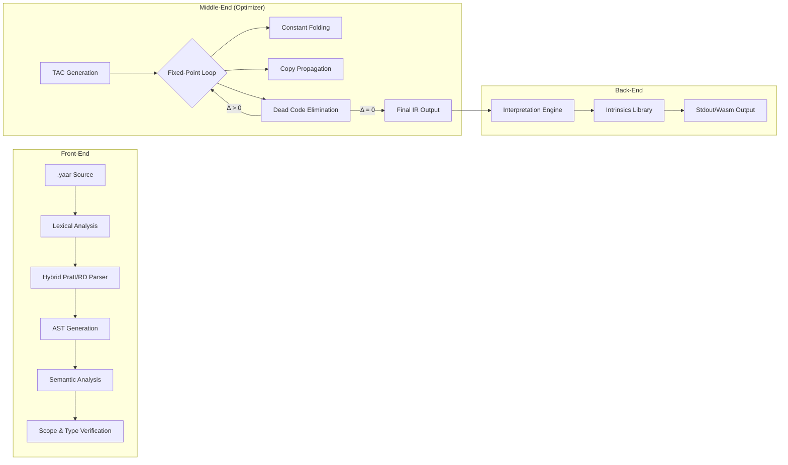

# 🚀 YaarScript: Industrial-Grade Middle-End Compiler

[](https://yaarscript.netlify.app/)

**YaarScript** is a high-performance, multi-phase compiler implemented in Rust, targeting a localized Urdu-slang syntax for systems-level logic. Unlike basic interpreters, YaarScript employs an industrial middle-end pipeline, featuring a **Fixed-Point Convergence Optimizer** and a rigorous **Static Type-Checking** engine.

---

## 🏗️ Architectural Pipeline

YaarScript adheres to the classic compiler front-end and middle-end separation. The pipeline ensures that the high-level Urdu abstractions are lowered into an optimized linear Intermediate Representation (IR) before execution.



---

## 🔬 The Middle-End: Fixed-Point Convergence

The core of YaarScript's efficiency lies in its `IROptimizer`. The optimization engine utilizes a **Convergence Model**, repeatedly applying multiple analysis passes until the Intermediate Representation reaches a stable state (where the difference between passes $\Delta = 0$).

### Optimization Pass Specifications

1.  **Multi-Type Constant Folding**: Resolves arithmetic and logical expressions at compile-time. Supports folding of `number`, `float`, and `faisla` types, including complex power operations.
2.  **Global/Local Propagation**: Propagates constant literals across basic blocks.
3.  **Algebraic Simplification**: Implements mathematical identities to prune redundant operations:
    *   $x + 0 \equiv x$
    *   $x \times 1 \equiv x$
    *   $x \times 0 \equiv 0$
    *   $x - x \equiv 0$
4.  **Dead Code Elimination (DCE)**: Prunes assignments and computations whose values are not consumed by any side-effecting operation (like `bolo`).

### Implementation: The Convergence Loop
```rust
pub fn run(&mut self) {
    let mut modified = true;
    let mut iterations = 0;
    const MAX_ITERATIONS: usize = 10;

    // Fixed-point iteration: run until the IR is stable (Δ = 0)
    while modified && iterations < MAX_ITERATIONS {
        modified = false;
        iterations += 1;

        modified |= self.constant_folding();
        modified |= self.constant_propagation();
        modified |= self.copy_propagation();
        modified |= self.peephole_optimization();
        modified |= self.dead_code_elimination_pass();
    }
}
```

---

## ⚡ The Power Operator (`**`)

YaarScript implements a first-class **Power Operator** (`**`), integrated directly at the Lexer level as a `TokenType::Power`. It occupies **Precedence Level 9**, sitting strictly above standard binary multiplicative operators to handle right-associative mathematical expectations.

| Level | Description | Operators |
| :--- | :--- | :--- |
| **8** | Multiplicative | `*`, `/`, `%` |
| **9** | **Exponentiation** | **`**`** |
| **10** | Unary | `-`, `!`, `++`, `--` |

### Backend Logic
*   **Integers**: Leverages `i64::pow(u32)` with compile-time overflow checks.
*   **Floats**: Leverages `f64::powf(f64)` for handling fractional exponents.

---

## 🌍 Urdu-Native Semantic Mapping

YaarScript provides a semantic mapping layer that translates localized Urdu slang into robust systems logic. This allows developers to write low-level code using expressive, native terminology without sacrificing type safety.

| YaarScript Keyword | C-Equivalent | Purpose |
| :--- | :--- | :--- |
| `number` | `int64_t` | Signed 64-bit integer |
| `faisla` | `bool` | Boolean type |
| `sahi` | `true` | Boolean literal true |
| `galat` | `false` | Boolean literal false |
| `agar` | `if` | Conditional branch |
| `warna` | `else` | Alternative branch |
| `jabtak` | `while` | Loop continuation |
| `bas_kar` | `break` | Scope exit |
| `ittifaq` | `rand()` | Entropy source |

---

## 🛡️ Intrinsic Safeguarding

To prevent the optimizer from incorrectly pruning vital system calls, every intrinsic function has a dedicated instruction in the Three-Address Code (TAC) pipeline.

*   **`READ` (suno)**: Pauses execution for standard input.
*   **`TIME` (waqt)**: Retrieves high-resolution system timestamps.
*   **`RANDOM` (ittifaq)**: Interacts with the Rust `rand` crate to fetch entropy.

> [!IMPORTANT]
> These intrinsics are marked as **Side-Effect Producing** (volatile) in the DCE pass to ensure they are never optimized away, even if their return values appear unused in the immediate local scope.

---

## 💻 Code Evidence

### YaarScript: Exponentiation & Entropy
```rust
yaar {
    number base = 2;
    number exp = 10;
    
    // Power Operator (Precedence 9)
    number result = base ** exp; // Eval: 1024
    
    // System Intrinsic: Random range [1, 100]
    number roll = ittifaq(1, 100);
    
    agar (roll > 50) {
        bolo("High Roll: ", roll);
    } warna {
        bolo("Low Roll: ", roll);
    }
}
```

---

## ⚙️ Technical Specifications

*   **Compiler Backend**: Rust 2024 Stable.
*   **Intermediate Representation**: Linear Three-Address Code (TAC) with symbolic labels.
*   **Memory Management**: Automatic stack-based variable allocation within the execution engine.
*   **Dependencies**: 
    *   `rand`: Cryptographically secure pseudorandom number generation.
    *   `colored`: Terminal-based AST and IR visualization.

---

> [!TIP]
> Use the `--release` flag when compiling the compiler itself to maximize the speed of the Optimizer's Fixed-Point loop.
